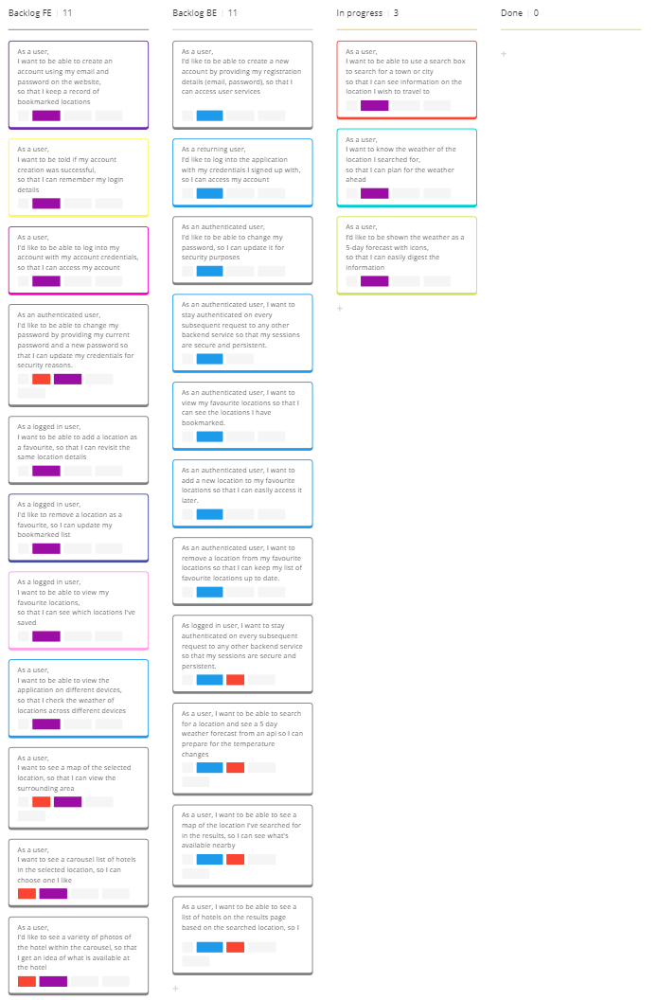

# User Stories & Routing Diagrams

## User Stories

### User Story 1

As a user, I'd like to be able to create a new account by providing my registration details (email, password), so that I can access user services.

**Tests**

- [ ] Test the user registration function to ensure it correctly processes valid input and rejects invalid input.
- [ ] Test validation rules (e.g., email format, password strength).
- [ ] Ensure the registration endpoint correctly interacts with the database to create a new user.
- [ ] Verify that the endpoint returns appropriate success or error messages.
- [ ] Registering with an already taken username or email and check should throw an error response.
- [ ] Missing or malformed input data should throw an error response.

### User Story 2

As a returning user, I'd like to log into the application with my credentials I signed up with, so I can access my account.

**Tests**

- [ ] Test the user authentication function to ensure it correctly validates user credentials.
- [ ] Test password hashing and comparison.
- [ ] Verify that the login endpoint correctly interacts with the user database.
- [ ] Check that a session token is generated and returned upon successful login.
- [ ] Test login with incorrect username or password and ensure an error message is returned.
- [ ] Test with missing or malformed input data.

### User Story 3

As an authenticated user, I'd like to be able to change my password, so I can update it for security purposes.

**Tests**

- [ ] Test the password update function to ensure it verifies the current password and updates to the new password correctly.
- [ ] Test validation rules for the new password.
- [ ] Verify that the password change endpoint correctly interacts with the database to update the password.
- [ ] Ensure appropriate success or error messages are returned.
- [ ] Test with incorrect current password and check for the correct error response.
- [ ] Test with missing or malformed input data.

### User Story 4

As an authenticated user, I want to stay authenticated on every subsequent request to any other backend service so that my sessions are secure and persistent.

**Tests**

- [ ] Test middleware or functions that validate session tokens.
- [ ] Verify that protected endpoints correctly validate the session token before processing requests.
- [ ] Test with expired or invalid tokens and ensure access is denied with an appropriate error message.

### User Story 5

As an authenticated user, I want to view my favourite locations so that I can see the locations I have bookmarked.

**Tests**

- [ ] Test the function that retrieves favourite locations from the database.
- [ ] Verify that the endpoint returns the correct list of favourite locations for authenticated users.
- [ ] Test with no favourite locations and ensure an empty list is returned.

### User Story 6

As an authenticated user, I want to add a new location to my favourite locations so that I can easily access it later.

**Tests**

- [ ] Test the function that adds a location to the user's favourites.
- [ ] Verify that the endpoint correctly adds the location to the database and associates it with the authenticated user.
- [ ] Test adding a duplicate location and ensure the appropriate response is returned.

### User Story 7

As an authenticated user, I want to remove a location from my favourite locations so that I can keep my list of favourite locations up to date.

**Tests**

- [ ] Test the function that removes a location from the user's favourites.
- [ ] Verify that the endpoint correctly removes the location from the database.
- [ ] Test removing a non-existent location and ensure the appropriate response is returned.

**Additional Requirements**

### User Story 8

As a user, I want to be able to search for a location and see a 5 day weather forecast from an api so I can prepare for the temperature changes.

### User Story 9

As a user, I want to be able to see a map of the location I've searched for in the results, so I can see what's available nearby.

### User Story 10

As a user, I want to be able to see a list of hotels on the results page based on the searched location, so I can look to book a hotel for the week I'm staying.

## Kanban Board

To help organise my tasks, tests and diagrams, I used Miro's features to create a kanban board and build diagrams.\

